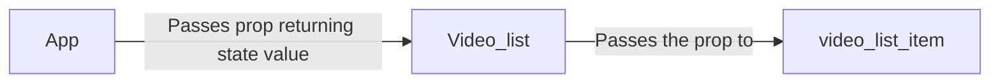

# These are some notes for learning react.

  

React is a front-end library which is component based and makes it easy to readily develop and prototype applications.

Its virtual DOM technology is fast and gives extra benefits compared to the normal DOM.

  

## JSX

JSX is a way of writing HTML directily into react components without using the default react syntax. It makes it easy to write HTML directly and more fluenty.

  

## Functional Components vs Class-based Components

* Functional components are just javascript functions which inherit no extra functionalities, they don't have any state and many other features.

* Class-based components are components which can have a state object and many other extended functionalities inherited from the **React Component** class. Use this whenever data is changing over time and we need to react to it.

* A functional component may contain a class-based component.

  
  

## State Management

* State is a plain JS object which is used to record and react to user events. Each class-based component has a state object.

  

* If a component state changes, the whole component is re-rendered and all its childs are re-rendered.

  

### Constructor and State

* Use constructor to preset values before object loads.

* Use super(props) to inherit from the super class (Component).

* Initialize state object by `this.state = {someObject: someValue}`

* To give a new state to a value in the object use `this.setState({someObject: someValue})`

*  **Be careful in how you referrence `this`** use `this.methodName = this.methodName.bind(this)` to bind `this` to the context of state object or use the arrow function to automatically do proper lexical scoping `methodName = (e) => { process }`

  

### Controlled Components

A controlled field is a form element like an input whose value is set by the state. Remember, state is the boss, and element(input) is the worker.

A controlled component's value is only changed when the state is changed.

  

* The state should tell the input what its value should be.

  
  

## Ajax

* The most parent component should be responsible for fetching data. [Data downward flow]

* Can't use `class` keyword for setting CSS class in JSX, instead use **`className`** to give CSS classes to JSX elements.

  

### Props

* Passing data from parent to child is done by passing `props`

* In a functional component, **props** is an argument so it can be used as is. In a class based component, **props** is available throughout the scope so you need to use **`this.props`** to access it

* Be sure to check whether props or state is empty or filled, React is asynchronous and doesn't wait for data to be fetched completely before loading the DOM. Be sure to place checks in all components so it doesn't end up in errors.

  

#### Traversing multi level childs to pass props

# General ES6 and ES7 recommendations

* Use arrow functions. `function(data) {}` to `(data) => {}`

* Use single value object updates. `{videos: videos}` to `{videos}`, it serves the same purpose and looks leaner.

* Use `map`, `filt+er` etc. for ~~processing~~ objects and arrays rather than normal for loops.